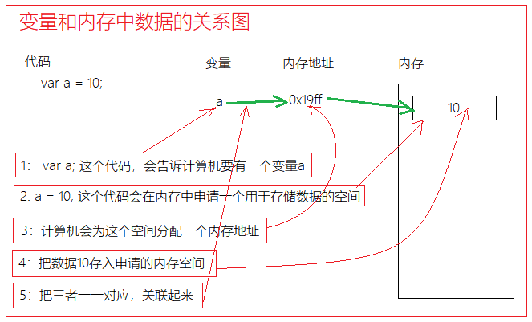
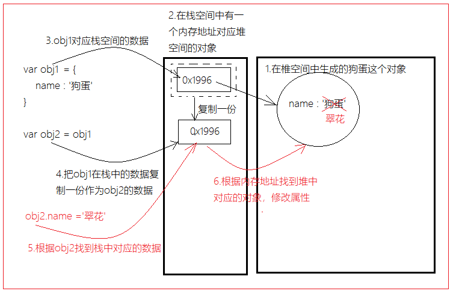

# 01-js-介绍及初体验

* 脚本 编程（带脑子）语言；
* JS作用：与用户交流互动，交互；


# 02-js-引入方式

* 内嵌式：demo学习阶段
* 外链式：工作使用
* 行内：了解，一般不用；


# 03-js-注释

* 注释：把自己的理解步骤要写出来

```css
  // 1.单行注释  ctrl+/ 用于简单说明；


  // 2.多行注释  ctrl+shift+/
  /* 
  * 比较多的注释
  * 比较多的注释
  * 比较多的注释
  * 比较多的注释
  * 比较多的注释
  * 比较多的注释
  * 比较多的注释
  * 比较多的注释
  * 比较多的注释
  */
```


# 04-js-输入输出

* 语法：

```js
输入:信息必须要带单（双）引号
prompt("引导信息")

输出：
alert("弹出框信息")

console.log("在控制台输出的信息")  调试；
console.log("info1", "info2")   多个输出，逗号隔开；

document.write("页面中输出的信息，可以识别HTML代码");
```


# 05-js-变量-语法及存储

* 语法：

```js
var a = 10;
// 1.声明变量 var a;
// 2.给变量赋值 a = 10;

  // 2.接受用户输入的信息
  // var a = prompt("输入一些信息");
  // alert(a);

  // 3. 两个过程：声明变量、变量赋值
  // var num_1 = 10;
  // var num_1;
  // num_1 = 10;


  // 4.声明赋值后，可以再次赋值
  // var a = 100;
  // a = 200;
  // alert(a);


  // 5.声明赋值后，变量参加运算，再次赋值给自己；
  // var a = 10;
  // a = a + 20;
  // alert(a);
```

* 储存：




# 06-js-变量-命名

* 范围：字母、数字、下划线、$符号；
* 市场上，一般用驼峰；
* 根据公司的需要：变量用英文；

```js
var user_name;
```


# 07-js-变量-交换两个值

```js
  // 需求：换两个变量的值；
  var a = 1;
  var b = 10;

  console.log(a, b);

  // 分析： 两杯水，找个空杯子；
  // 1.声明一个空的变量：空杯子；
  var c;
  // 2.把其中一个变量的值赋值给c;
  // 把a里面的值 复制一份 赋值给c;
  c = a;
  // 3.a变量 赋值  为  b的变量：把b的值 赋值 给a;
  a = b;
  // 4.把c里面存的a的数据，赋值给b;
  b = c;
```


# 08-js-变量-补充

* 可以多次声明和赋值；

```js
  // var a;
  // var b;

  // 声明多个变量；
  // var a, b, c, d;


  // var a = 1;
  // var b = 2;
  // 可以多个声明且赋值；
  // var a = 1,b = 2;


  var a = 10;
  // 把a的值 赋值 给 变量b；
  var b = a;

  console.log(a, b);
```


# 09-js-数据-5种简单值类型

* 语法：源于生活；

```js
  // number 类型
  // var a = 10.1;
  // NaN：不是某个数，泛指；
  // var a = NaN;


  //2. string 类型，字符串:必须加单（双）引号；
  // var a = "abc";
  // var a = abc;
  // prompt("引导信息是字符串");
  // alert("abc");
  // alert(abc);


  // 3.Boolean类型:true 或false;
  // 运算符优先级：先算 比较  在进行赋值；
  // var a = 5 > 4;
  // 成立的事情：返回一个true;
  // console.log(a);

  // var b = 0 > 4;
  // console.log(b);


  // 4.null 值；
  // var a = null;


  // 5. undefined类型也是值：初始化一个变量，没有赋值，默认值就是 undefined
  // var a;
  // console.log(a);
```


# 10-js-数据-检查类型

* 语法：

```js
  // 1.number 类型
  // var a = 10;
  // var a_type = typeof a;
  // console.log(a, a_type);

  // var a = NaN;
  // console.log(a, typeof a);


  // 2.string 类型：必须带单双引号；
  // var a = "abc";
  // console.log(a, typeof(a));


  // 3.boolean类型：两个个
  // var a = 5 > 4;
  // console.log(a, typeof a);


  // 4.null值；空；
  // var a = null;
  // console.log(a, typeof a);


  // 5.undefined类型：值undefined
  // var a;
  // console.log(a, typeof a);
```


# 11-js-案例-工资计算1

```js
  // 老板输入绩效工资
  // 接受的ji_xiao  用户prompt输入数据，默认接受到时string类型；
  var ji_xiao = prompt("请输入铁蛋的绩效工资：");

  // 基本工资
  var ji_ben = 3000;

  // string类型遇到 + ，把其他类型转为string类型，形成字符串拼接；
  alert(ji_ben + ji_xiao);
```


# 12-js-转化-转数字

* 语法：Number();

```js
  // 其他 变 数字


  // 其他：string  boolean null undefined

  // 1.string
  // var a = "abc";
  // result
  // var res = Number(a);
  // console.log(a, res);


  // var a = "我";
  // var res = Number(a);
  // console.log(a, res);


  // 字符串里面是数字的字符串可以转为number数字；
  // var a = '10';
  // var res = Number(a);
  // console.log(a, res);


  // 2.boolean:0 1;
  // var a = true;
  // var res = Number(a);
  // console.log(a, res);
  // var a = false;
  // var res = Number(a);
  // console.log(a, res);


  // 3.null值 空；
  // var a = null;
  // var res = Number(a);
  // console.log(a, res);


  // 4.undefined类型:未定义值转为数据类型，只能给一个  不是某个数  NaN；
  // var a;
  // var res = Number(a);
  // console.log(a, res);
```

* parseInt()、parseFloat()：

```js
  // ---------------------------------------------------------
  // 1.String类型
  // var a = "abc";
  // var res = parseInt(a);
  // console.log(a, res);


  // 转整数；
  // 字符串里面包的数字的字符串；
  // var a = "1000.1456652568889";
  // var res = parseInt(a);
  // console.log(a, res);


  // 字符串 只能前面的部分有数字组成，把数字部分的字符串转为整数；
  // var a = "1000abc";
  // var res = parseInt(a);
  // console.log(a, res);

  // var a = "abc1000";
  // var res = parseInt(a);
  // console.log(a, res);


  // 2.true null undefined 都转化为NaN;
  // var a = true;
  // var res = parseInt(a);
  // console.log(a, res);


  // ---------------------------------------------------------------
  // parseFloat();
  // 1.true null undefined 都转化为NaN;
  // 2.string；
  // var a = "1000.1212abc";
  // var res_a = parseInt(a);
  // console.log(a, res_a);

  // var b = "1000.1212abc";
  // var res_b = parseFloat(b);
  // console.log(b, res_b);
```


# 12-js-案例-工资计算2

```js
  // 接受的ji_xiao  用户prompt输入数据，默认接受到时string类型；
  var ji_xiao = prompt("请输入铁蛋的绩效工资：");

  // 转之后；
  var ji_xiao_numb = parseFloat(ji_xiao);
  // var ji_xiao_numb = Number(ji_xiao);

  // 基本工资
  var ji_ben = 3000;

  // string类型遇到 + ，把其他类型转为string类型，形成字符串拼接；
  alert(ji_ben + ji_xiao_numb);
```


# 13-js-转化-转字符串

* 语法：

```js
  // String():字符串
  // 其他：Number类型、Boolean类型、null（值）、undefined（值undefined）

  // 1.Number 10 12 NaN
  // var a = 10;
  // var res = String(a);
  // console.log(a, res, typeof res);


  // var a = NaN;
  // var res = String(a);
  // console.log(a, res, typeof res);


  // 2.null Boolean undefined
  // var a = null;
  // var res = String(a);
  // console.log(a, res, typeof res);


  // var a = true;
  // var res = String(a);
  // console.log(a, res, typeof res);


  // ----------------------------------------------------------------
  // .toString()
  // 1.Number 类型
  // var a = 10;
  // var res = a.toString();
  // console.log(a, res, typeof res);


  // var a = false;
  // var res = a.toString();
  // console.log(a, res, typeof res);

  //注意： undefined 和 null不能使用这个方式变成字符串；
```


# 14-js-转化-转Boolean

* 结果：返回一个Boolean值；

```js
  //  转 Boolean 结果：存在 不存在(不确定)false 返回就是一个布尔值；

  // 1.string 
  // var a = "abc";
  // var res = Boolean(a);
  // console.log(a, res);


  // 2. Number
  // var a = 10;
  // var res = Boolean(a);
  // console.log(a, res);


  // var a = 0;
  // var res = Boolean(a);
  // console.log(a, res);


  // var a = NaN;
  // var res = Boolean(a);
  // console.log(a, res);


  // 3.null
  // var a = null;
  // var res = Boolean(a);
  // console.log(a, res);


  // 4.
  // var a;
  // var res = Boolean(a);
  // console.log(a, res);
```

* 转化为false的几种情况:

```js
var res1 = Boolean(0);
console.log(res1); //输出false
var res3 = Boolean(NaN);
console.log(res3); //输出false
var res2 = Boolean('');// 空字符，里面啥没有，空格也没有；
console.log(res2); //输出false


var res6 = Boolean(false);
console.log(res6); //输出false


var res5 = Boolean(null);
console.log(res5); //输出false

var res4 = Boolean(undefined); 
console.log(res4); //输出false
```


# 15-js-转化-小结

* 为什么？为了数据运算；

* 转数字：
  * 方法：
    * Number()：
      * "abc100"---->NaN;
    * parseInt()、parseFloat()：
      * 转成功，字符串前面的组成部分有数字；
      * true/null/undefined  转为NaN；
  * 结果：数字（0,1,10，NaN）
* 转字符串：相当于给你要转的这个数据左右两边加单双引号；
  * String(NaN)  :  ------>"NaN";
  * .toString()  :   null undefined 不能用；
* 转布尔值：
  * Boolean（）：结果返回布尔值；
  * 转false6种情况
    * 空字符串：“”
    * 数字：0、NaN；
    * null、undefined
    * false


# 16-js-操作符-算术操作符-01

* 语法：常规需要Number类型
* 重点：**字符串遇见+；**

````js
// 1.常规操作：Number类型

  // var a = 10;
  // var b = 3;
  // + - / * %
  // var c = a + b;

  // 10对3取余数；
  // var c = 10 % 3;
  // console.log(c);


  // 2.非常规：字符串、Boolean、null、undefined；
  // 字符串 遇见 +，把左右的数据类型 转化为字符串 
  // 字符串 + 字符串 ：字符串拼接；
  // var a = 10 + "10";
  // var a = true + "10";
  // console.log(a, typeof a);

  // 运算：从左到右运算；
  // var a = 10 + 10 + "10";
  // console.log(a);


  // 只要字符串不是遇见+，遇见-*/% ，字符串会 隐式 转化 Number类型； 
  // var a = 10 - "10";
  // console.log(a, typeof a);

  // var a = 10 - "我";
  // console.log(a, typeof a);


  // 2.其他(排出string类型外)：true null undefined
  // 隐式转化：转为数字类型；
  // 输出 10
  // var a = false + 10;
  // console.log(a);


  // 输出 10
  // var a = null + 10;
  // console.log(a);

  // 输出 NaN
  // var a = undefined + 10;
  // console.log(a);

````

# 16-js-操作符-算术操作符-02

* ++ --
* 口诀：
  * ++放在变量**前面**，什么时候计算++？先算++，在算整个运算；
  * ++放在变量后面，什么时候计算++？先算整个运算，再算++；

```js
  // 口诀：++处于a的后面，++什么时候算？整个计算式子 计算完后再计算++；
  // 第一步：a + 10;
  // 第二步：a++;
  // var a = 10;
  // var b = a++ + 10;
  // console.log(a, b);  11 20


  // 口诀：++处于a的前面，++什么时候算？先计算++，再计算整个式子；
  // var a = 10;
  // var b = ++a + 10;
  // 第一步：++a; 11
  // 第二步：11 + 10
  // console.log(a, b);


  var a = 10;
  var b = a++ + ++a;
  // 第1步：a:11
  // 第2步：a++ + 11 ----->11 + 11  b：22
  // 第3步：a:12;
  console.log(a, b);

```


# 17-js-操作符-比较运算符

* 常规操作：左右需要Number类型；

```js
  // 比较运算符：> < >= <=


  // 常规操作：比数字类型
  // 返回:这个比较后的结果状态 Boolean；

  // 优先级：比较运算 优先于 赋值运算；
  // >= 只有要一个条件满足返回true;
  // var a = 5 >= 5;
  // console.log(a);


  // 了解即可；
  // 非常规操作:非Number类型要和Number类型比较的话，非Number类型就要隐式转换为数字
  // var a = "abc" > 1;
  // NaN > 1;
  // console.log(a);


```

* 重点:  ==  ===

```js
  // == ：比较数据是否相等；
  // 左右两边，数据类型不同，不同的类型就要隐式转换为Number类型
  // var a = 0 == false;
  // console.log(a);

  // 左右两边，数据类型相同，比值；
  // var a = 10 == 10;
  // console.log(a);


  // var a = "abc" == "hgh";
  // console.log(a);


  // var a = null == null;
  // console.log(a);

  // 特别：
  // var a = NaN == NaN;
  // console.log(a);


  // ===：
  // 左右两个类型必须相同，才会比值是否相同，
  // 如类型不同 直接返回false;

  // var a = 0 == false;
  // console.log(a);


  // var b = 0 === false;
  // console.log(b);

```


# 18-js-操作符-逻辑运算符

* 语法：

```js
  // && 且 ：全部满足，如果有一个条件不满足，直接返回false;
  // 如何使用： && 左右两边会跟有数据 或运算；

  // var a = 1 == 1 && 2 == 2;
  // console.log(a);


  // 要求输入用户名和密码，且登录成功；
  // var userName = prompt("请输入用户名");
  // var password = prompt("请输入密码");

  // // admin 123
  // console.log(userName == "admin" && password == "123");


  // || ：或 ，只要满足一个条件true就可以了；

  // 小于5岁或者 身高小于120cm 就可免费坐车；
  // var age = prompt("请输入你的年龄");
  // age = parseFloat(age);

  // var height = prompt("请输入你的身高(cm)");
  // height = parseFloat(height);

  // //
  // console.log(age < 5 || height < 120);


  // !:取反；Boolean值取返；常规:使用Boolean;
  var a = true;
  a = !a;
  console.log(a);

```


# 19-js-操作符-赋值运算符

* 语法：

```js
// = 的作用就是把右边的结果赋值(存储)给左边的变量之类的容器
var a = 10;

// 相当于是 a = a + 2; 就是一个简写的语法
// -=   *=   /=   %= 除了运算规则不同，作用是一样的，都是简写
a += 2; 
console.log(a); // 输出12

// 非常规
var a = 'cc';
a +=2;

```


# 20-js-操作符-优先级

```js
  // 1. 第一优先级：()
  // 2. 第二优先级：++ -- !
  // 3. 第三优先级： * /  %
  // 4. 第四优先级： + -
  // 5. 第五优先级： > >= < <=
  // 6. 第六优先级： == != === !==
  //  7. 第七优先级： &&
  //   8. 第八优先级： ||
  //   9. 第九优先级： = += -= *= /= %=  
  var a = 200 === (10 + 10) * 10 > 1;
  // 200===20*10>1
  // 200===200 > 1
  // 200 === true:
  console.log(a);

```


# 21-总结

* 输入：prompt("引导信息")，接受数据类型：string类型；

* 输出：console.log("信息 1","信息 2")  ；

* 变量：

  * 储存数据。
  * 数据类型：string 、Number 、Boolean、null、undefined;
  * 查看类型：typeof a; typeof(a);

* 运算符：

  * 算术运算符：
    * 字符串遇见+：左右两边数据类型转换为是string类型，形成字符串拼接；
    * ++ ：
      * ++处于变量前，先计算++，后计算整个运算；
      * ++处于变量后，后计算++，先计算整个运算；
  * 比较运算符：
    * ==：
      * 数量类型不同的时候，不同的类型要隐式转化为Number类型，再去比值；
      * 数量类型相同的时候，直接比值的是否相等；
    * ===：如果数据类型不同，直接返回false;
  * 逻辑：
    * &&：只要有一个false。直接&&运算符返回false；
    * ||：只要有一个true,直接||运算返回true;
    * !：Boolean值取反；


# day02

# 00-字符串-转译字符

- 程序中，默认把一对引号，认为就是字符串的结束；

```js
console.log("小明说:"小红明天真漂亮"");
```

- 此时会在控制台中报错： Uncaught SyntaxError: missing ) after argument list；在想要转义的字符前面加上一 `\`；

```js
// 单双引号可以相互包着，能显示；
console.log('小明说:"小红明天真漂亮'");
```

- 转译字符：把**特殊的字符**转成 JS 可以读的字符；
- 特殊的字符：`""  '' \`

```js
console.log("小明说:\"小红明天真漂亮\"");

  // 1.解决1："  '  单双引号的配合使用
  console.log('我说: "阿萨达是大所多 "')
  console.log("我说：'xxxxxxx'");

  // 2.转译字符：把特殊字符:  " ' \ 
  console.log("我说：\'xxxxxxx\',\"阿萨\\达是多\"");

  // 3.es6语法
```


# 01-流程控制-三个名词-了解

* 表达式：有返回结果；**在浏览器后台可以直接敲表达式，回车返回的就是该表达式的结果；**
* 语句：有思考在里面的表达式；思考主要是告诉浏览器要做什么事情；
* 结构：
  * 分支：**不同的情况，走不同的分支；**
  * 循环结构：要求一个流程要有**重复的思想**在里面；


# 02-分支结构-if-else

* 语法：不同分情况，走不同的分支；只要进入其中一个分支，其他分支都不会执行；

```js
  // 多个分支；
  // 第一个分支:
  if (a == "他") {
    console.log("这是个男的");
  }
  // 第二个分支的表达式
  else if (a == "她") {
    console.log("这是个女的");
  }
  // 表达式返回false,另外一种情况
  else {
    console.log("你这个不男不女的家伙");
  }
```


# 03-分支结构-案例-求最大值

* 业务需求：用户可以输入两次数，返给我这两个数的最大值；
* 分析：
  * 1.让用户可以输入两次，设置变量进行接受
  * 2.数据类型转换；prompt接受到数据类型是string类型；
  * 3.分支结构；


# 04-分支结构-switch-case

* 场景：变量与多个固定值进行  === 比较判断；
* 非常规：case里面的break不是必须的，但是如果没有break,会继续往下执行；直到遇到下一个break;

```js
  // 语法
  switch (info) {
    // 其中一种情况
    case "一":
      // 当info === "一"
      console.log("睡觉");
      break;

    case "二":
      // 当info === "二"

      console.log("吃饭");
      break;
    case "三":
      // 当info === "三"
      console.log("玩游戏");
      break;
      // 其他情况：上面都不满足的时候，执行
    default:
      console.log("敲代码");
      break;
  }
```


# 05-分支结构-三元表达式

* if else 简写，有返回值；

```js
  // 求两个数的最大值
  var a = 10;
  var b = 99;

  // 三元表达式：把后面表达式2 或者 表达式3的结果作为整个三元表达式的结果返回；
  // 表达式1 ? 表达式2 : 表达式2;

  var max = a > b ? a : b;
  console.log("最大值是" + max);


  // if else 简写
  if (a > b) {
    max = a;
  } else {
    max = b;
  }
```


# 06-循环结构-while--01-语法

* 语法

```js
  var a = 1;

  // 让循环有退出的条件：在循环体内部让外部判断条件的某些变量变化；
  while (a < 10) {
    // 
    console.log(a);

    a++;
  }


  // a:1  第一次执行完  a:2
  // a:2  第2次执行完   a:3
  // ...
  // a:9  第9次执行完   a:10
  // a:10 不执行第10次；
```


# 07-循环结构-while-01-求和

* 需求：求1-10和；
* 分析：
  * 1-10 依次点名，需要while循环语法；
  * 每次循环一次，把每次点名的数加到某个变量上；

```js
  // - 1-10 依次点名，需要while循环语法；
  // -每次循环一次， 把每次点名的数加到某个变量上；
  var a = 1;

  var sum = 0;

  while (a <= 3) {

    // 每一次执行
    console.log(a);
    // 每次循环一次， 把每次点名的数加到某个变量上
    // sum = sum + a;
    // 赋值运算符
    sum += a;
    
      // 循环退出的条件
    a++;
  }

  console.log("-----------------------");
  // 循环结束
  console.log(sum);
```


# 07-循环结构-while-02-打印偶数

* 需求：1-100之间所有偶数 打印出来；
* 分析：
  * 数一个一个过，循环；
  * 过：偶数的条件？分支结构、余数为0 ：   a%2==0;

```js
  var a = 1;
  while (a <= 100) {
    // console.log(a);

    // condition:每次过的时候，判断当前这个数据是否为偶数
    if (a % 2 == 0) {
      console.log(a);
    }
    // 退出循环代码；
    a++;
  }
```


# 08-循环结构-for

```js
  // var a = 1：初始化表达式，只执行一次；
  // a <= 10：条件表达式
  // a++：自增，用于退出；
  for (var a = 1; a <= 3; a++) {
    console.log(a);
  }


  // 1初始化表达式，只执行一次；
  // 2执行条件表达式，true;
  // 3.执行循环体；
  // 4.执行自增表达式；
  // 5.重复 234，直到条件表达式返回false;
```


# 09-循环结构-案例-求偶数和

* 需求：求1-100之间所有偶数的和；

* 分析：
  * 1-100之间所有数，过一次，循环for;
  * 条件找偶数：a%2 == 0   分支；
  * 进入分支：数绝对是偶数，求和；（把每个数加在某变量上面）；

```js
  var sum = 0;

  for (var index = 1; index <= 10; index++) {
    // const element = array[index];
    // console.log(index);
    // 成立
    if (index % 2 == 0) {
      // 现在的index绝对是偶数
      sum = sum + index;

    }
  }

  // for循环执行完毕
  console.log(sum);
```


# 10-循环结构-案例-打印正方形-01

```js
  // 打印10行
  // 一行一行的打印：指定打印的行数
  // 外面for循环，某次执行完成的时间：里面的所有的循环执行完成后，算外面for当次完成；
  for (var index = 1; index <= 10; index++) {
    // console.log(index);

    // 把每行的数据要打印出来；
    // 每一次的操作：打印一行：
    // document.write("oooooooooo");
    // 打印一行；
    // 一个一个的打印 10个
    for (var jndex = 1; jndex <= 10; jndex++) {
      document.write("o");
    }

    // 换行符
    document.write("</br>");
  }
```


# 11-循环结构-案例-打印金字塔

```js
  // 打第一行的时候，打1个；
  // 打第二行的时候，打2个；
  // ...
  // 打第九行的时候，打9个；
  // 打第十行的时候，打10个；


  // 外面for  控制打第几行；
  // 里面for  控制在每一行打几个；

  // 控制打几行
  for (var i = 1; i <= 10; i++) {

    // 每次打印的时候，打印几个，来自于是现在是第几行
    for (var j = 1; j <= i; j++) {

      // 输出 文字
      document.write("o");

    }

    // 换行
    document.write("<br/>")
  }
```


# 12-循环结构-do-while循环及小结

* while、do-while 循环不易看出循环的次数，一般用于**未知次数的循环**
* for循环明显看出循环的次数，一般用于已知次数的循环；**使用最多是for；**
* while、for循环可能一次循环都不会执行
* do-while 循环至少执行一次；


# 13-循环结构-break和continue

* 语法：

```
  // break
  // for (var i = 1; i <= 6; i++) {
  //   console.log(i);

  //   // 条件判断
  //   if (i == 3) {
  //     // 不需要往后继续循环执行；
  //     // 结束for  while do-while
  //     break;
  //   }

  // }


  // 在3楼无需停,经过3 无需打印
  for (var i = 1; i < 7; i++) {

    if (i == 3) {
      // 把当次循环，跳过；
      continue;
    }

    console.log(i);
  }
```


# 14-总结

* 名称：
  * 表达式：返回结果；
  * 语句：升级版（思考、告诉浏览器做什么事情）的表达式；

* 结构：

  * 分支结构：不同的情况做不同事，不同条件，执行不同的代码；一次只能进一个分支。
  * 循环结构：一个一个思路在里面，用循环，for;  while（true）{}


# day03

# 01-数组-介绍-声明-储值

* 数据类型：数组

```js
var arr = [];
// 字面量：从字面上我们判断出数据类型；
// 特点：有先后顺序（索引）、有长度的数据集合；

  // 空数组，里面还没有数据。
  // console.log(arr, typeof arr);

  // 2.存值：
  // 索引：又叫下标 标识位置；
  // 下标：从0开始 往上增加；

  arr[0] = 94;
  arr[1] = 85;
  arr[2] = 60;
  arr[3] = 70;
  // 在进行重新赋值；
  arr[0] = 100;

  console.log(arr);

  // 一开始你知道数组里面要放什么数据，
  // var arr_1 = ["abc", 1, null, undefined];
  // console.log(arr_1)

  // 3.取值；通过下标取数据
  // arr[0];  arr[下标]
  console.log(arr[3]);
```


# 02-数组-取值-遍历-长度

* 语法：

```js
// 遍历：把数组中每一项拿出来；参加业务计算；

var sum_1 = 0;
for (var i = 0; i < arr.length; i++) {
    // 获取数据
    // console.log(arr[i]);

    // 思路：把每个数组中的数据都加在某个变量自己上面；
    sum_1 = sum_1 + arr[i];
}

// arr.length：代表数组里有多少数据，
```

* 最大索引总是比长度少 1 ；


# 03-案例-数组元素的均值

* 求平均成绩：
  * 总和 / 总人数

```js
  // 需求：数组的均值；
  // 1.数组的初始化
  var arr = [100, 100, 100];

  // 2.总和
  // var sum = 0;
  // for (var i = 0; i < arr.length; i++) {
  //   // console.log(arr[i])

  //   // 循环体：每一次都会重新执行一次；
  //   sum = sum + arr[i];
  // }

  // var sum = 0;
  // sum = sum + arr[0];


  // var sum = 0;
  // sum = sum + arr[1];

  // 3.均值 = 总和 / 个数；
  // var avg = sum / arr.length;
```


# 04-案例-数组元素的最大值

* 需求：106个同学的身高都录入数据，存在数组里；找咱们班最高的人；
* 步骤：
  * 1.随机选取一个数组中值为假设的最大值；
  * 2.数组中每一个值都要和这个假设的最大值进行比较;

```js
  // 找出最大值的下标：
  // 最大下标：arr.length-1;
  // 步骤：
  // 1.随机假设一个下标，就是下标位置上的数据假设是最大值；
  var max_i = 2;
  var max = arr[max_i];

  // 2.循环遍历，一个一个的比较 和 最大值 比较  ，比较结构true: 记录下标，
  for (var i = 0; i < arr.length; i++) {
    // arr[i]

    if (arr[i] > max) {
      // 记录
      max = arr[i];
      max_i = i;
    }
  }

  // for结束
  console.log(max, max_i);
```


# 05-数组-构造函数

```js
  // 清空 数组
  // var arr = [1, 1, 1, 1];
  // // console.log(arr.length);
  // arr.length = 0;
  // console.log(arr);


  // 构造函数 声明 数组

  // 字面量: 
  // var arr_1 = [90, 9, 90];
  // console.log(arr_1);

  // 构造函数：构建出一个你想要的东西；
  // var arr_2 = new Array(90, 9, 90);
  // console.log(arr_2);


  // 有一个情况：只有一个数据
  var arr_1 = [90];
  console.log(arr_1);

  var arr_2 = new Array(90); // 长度为90的空数组；
  console.log(arr_2);
```


# 06-小娜v1-介绍-循环与退出

* 步骤：
  * 1.无限循环，
    * 1.1 弹窗：换行  \n;
  * 2. 输入q：退出无限循环 break;

```js
  // 1.分析  无限循环；
  // 转译字符：\' \" \\  \n 换行
  while (true) {
    // 接受到数据都是string类型；
    var info = prompt("你好，我是小娜，请选择功能：\n输入q：退出；\n1：求和；\n2：系统时间；\n3：讲笑话");

    // 2.输入q 退出 无限循环
    // 如果输入info是q,结束无限循环；
    if (info == "q") {
      // 友好的提示
      alert("难道你不爱我了么？");

      // 退出
      break;
    }

  }
```


# 07-小娜v1-求和

```js
  var str = "1.1,2,3";

  // 语法：把字符分 隔为 数组
  // 字符串.split(分隔的字符串):分隔,后面的小括号 里面要写要 分隔的字符串
  // 返回值：数组；里面每个元素就是string类型；
  var arr = str.split(",");

  // console.log(str, arr);


  // 给数组求和
  // 1.定义一个变量：数组中的每个数据要加到这个变量上；
  var sum = 0;
  for (var i = 0; i < arr.length; i++) {

    // arr[i] 每个元素

    // 每个元素 需要转为Number类型；
    arr[i] = parseFloat(arr[i]);
    sum = sum + arr[i];

    // sum = sum + parseFloat(arr[i]);
  }

  // 2.到这循环结束，求和完成；
  console.log(sum);
```


# 08-小娜v1-系统时间

```js
// 创建Date对象
var date = new Date();
console.log(data); // 系统时间不同，输出的结果也会不同，但是都是输出当前系统的时间

// 获取时间对象的各个部分，对象.方法();

// 获取年份
var year = date.getFullYear();
console.log(year);

// 获取月份 ， 得到的月份是从0开始的 ，使用 0-11 表示 1-12 月
var month = date.getMonth();
console.log(month);

// 获取天 have a date;
var day = date.getDate();

date.getDay();
console.log(day);

// 获取小时
var hour = date.getHours();
console.log(hour);

// 获取分钟
var minute = date.getMinutes();
console.log(minute);

// 获取秒数
var second = date.getSeconds();
console.log(second);
```

* 模板字符串

```js
// es6: 模板字符串  ``  ${变量名}
alert(`${year}-${month}-${riqi} ${hour}:${Minute}:${Second}`);
```


# 09-小娜v1-随机笑话

```js
  // 如何获取一个随机笑话
  // 内置一组的笑话：数组
  var arr = [
    "笑话1~~哈哈哈~~~~~~~~",
    "笑话2~~哈哈哈~~~~~~~~",
    "笑话3~~哈哈哈~~~~~~~~",
    "笑话4~~哈哈哈~~~~~~~~",
    "笑话5~~哈哈哈~~~~~~~~",
    "笑话6~~哈哈哈~~~~~~~~",
  ];


  // 随机的讲一个笑话：随机获取数组的一个下标；
  // 0 1 2 3 4 随机 任意给我一个就行了；


  // 如何获取随机数
  // var date = new Date();
  // Math：内置好的一个对象
  // random：返回一个 [0,1) 小数  表现形式  0~1 随机小数；
  var a = Math.random();
  // console.log(a);


  // 0-5随机小数
  // 原来是 0~1 放大了5倍 0-5
  a = a * arr.length;
  // console.log(a);


  // 向下取整
  // var b = Math.floor(1.999999999999);
  // console.log(b);
  a = Math.floor(a);
```


# 10-git-简单使用


# 11-总结

* 能够说出数组的作用：先后顺序，有长度的数据集合；为了更好的管理数据；
* 能够使用字面量的方式创建数组

```
var arr = [];
// 字面量：从字面上能知道数据的类型；
var a = "abc";
```

* 能够通过索引获取或设置数组中的数据

```
var arr = [];
arr[0] = 10;
console.log(arr[0])
```

* 能够通过for循环遍历数组中的数据并打印

```
// for循环遍历数组：index; 索引，下标，是有规律变化东西；
```

* 能够说出实现求一组数字中最大值的思路
  * 随机指定一个元素为最大；arr[0]
  * 那 你指定的这个元素和所有的元素作对比

* 能够说出Math对象的3个方法 

```js
Math.random()  0-1，不包括1；
Math.floor();  向下取整；
// 
Math.ceil();   向上取整；
```

* 能够说出Date对象的3个方法

```
var date = new Date();
日期  date.getDate();
星期几  date.getDay();
```

* 清空数组中的元素

```
arr.length = 0;
```

* 知道通过构造函数Array创建数组

```js
var arr = new Array();
```

# day04

# 01-函数-介绍-语法-调用

```js
function 函数名() {
// 要封装的代码，函数体
}

// 调用
函数名();
```

* 注意：不要重名（变量名一样）；


# 02-函数-参数-配置

*   如何配置参数：
    * 1.先根据业务需求，把你需要变化的数据，替换为变量(函数内部的变量，声明函数的时候，内部变量声明)  注意变量名命名、变量与数据直接拼接；
    * 2.把你替换后的变量名放在 函数后面的（）里；

```js
  // 形参：形式上参与运算的参数；
  function tellStory(a, b) {
    // 要封装的代码，函数体
    console.log("山上有庙");
    console.log("庙里有人");
    console.log(a + "对" + b + "说：");
  }
  
  // 调用有传入参数的函数
  // 实际参与运算参数：实参；
  tellStory("熊大", "熊B");

  // 函数不是那么死了，有参数可配置，
  tellStory("大猫", "二毛");
```


# 03-函数-参数-不赋值

* 语法

```js
  // 形参：形式上参与运算的参数；
  function tellStory(a, b) {
    // 要封装的代码，函数体
    console.log("山上有庙");
    console.log("庙里有人");
    console.log(a + "对" + b + "说：");

  }

  // 如果不传入实参：形参的默认值为undefined；
  tellStory();

  // 变量没有没有赋值，默认值就为undefined
  var a;
  console.log(a);
```

* 不传入参数的优化：

```js
  function tellStory(a, b) {
    // 默认值的优化：
    // 对a的值进行判断
    if (a == undefined) {
      a = "大和尚";
    }
    // 
    // else {
    //   a = a;
    // }


    if (b == undefined) {
      b = "小和尚";
    }
    // 
    // else {
    //   b = b;
    // }


    // 3元表达式
    a = a == undefined ? "大和尚" : a;
    b = b == undefined ? "小和尚" : b;


    // 要封装的代码，函数体
    console.log("山上有庙");
    console.log("庙里有人");
    console.log(a + "对" + b + "说：");

  }
```


# 04-函数-参数-形参与实参

```js
  var x = 20;
  var y = 10;

  // 形式上的参数：
  function demo(a, b) {
    a = a + b;
  }

  // 调用函数
  demo(x, y);

  // 内部的过程：
  // x:20-------> a  相当于  a = x;
  // y:10-------> b  相当于  b = y;

  // a = x  把X的值复制了一份赋值给a，a在内部做任何都和x没有任何关系；

  // 形参和实参的相互不影响：必须实参是简单数据类型（Number string Boolean undefined）
  // 
  // 20 10
  // 传入的实参：
  // console.log(x, y);
```


# 05-函数-返回值

* 语法：
  * 修改函数的返回值
  * 终止函数的执行

```js
// 函数内部没有一返回值，默认打印为undefined
  // return:作用1：去修改函数的返回值；语法：return 值或者变量；只能返回一个值；
  function qiuhe(a, b) {
    var sum = a + b;
    // console.log(sum);
    return sum;
  }

  // return : 终止函数return后面的函数的不执行；
  function fn() {
    console.log(1);
    return;

    console.log(2);
  }
```


# 06-函数-案例-求n-m和

* 需求：通过函数，把n-m之间所有的数的和，返回给我；

* 把实际过程写出：1-10

```js
// 求1-10和；
  // 需求：求n~m
  // 1~m

  // 1.实际过程
  // var sum = 0;
  // for (var i = 1; i <= 10; i++) {
  //   sum = sum + i;
  // }


  // 2.提炼为函数 1-m
  // function qiuhe(m) {
  //   var sum = 0;
  //   for (var i = 1; i <= m; i++) {
  //     sum = sum + i;
  //   }
  // }


  // 3. n-m 函数完成了,
  function qiuhe(n, m) {
    var sum = 0;
    for (var i = n; i <= m; i++) {
      sum = sum + i;
    }
    // console.log(sum);

    // 函数返回值；
    return sum;
  }

  // 外面接受到函数的返回值
  var sum = qiuhe(1, 3);
  console.log(sum);
```


# 07-函数-参数-arguments

* 语法：可以拿到没有明确数量的实参

```js
  // 多个参数配置，对于开发来说，不友好；
  // 函数内部的隐藏变量  arguments,不需要声明；
  // arguments：可以拿到没有明确数量的实参；看起来很像数组，不是真实数组；伪数组；
  // 有下标、有长度，遍历（下标）；

  function fn() {
    console.log(arguments.length);
    var sum = 0;
    for (var i = 0; i < arguments.length; i++) {
      // arguments[i]
      sum = sum + arguments[i];
    }
    console.log(sum);
    // return  
  }


  // fn(4, 10, 76, "abc", true, 0);
  fn(2, 2, 2, 2, 2);
```


# 08-函数-函数表达式-匿名函数

```js
  // 函数表达式 是另外一种声明的方式
  var fn_2 = function() {
    // 函数体；封装在此内部；
  }

  function fn_1() {
    // 函数体；封装在此内部；
  }


  // 匿名函数：没有函数名，JS不允许匿名函数单独存在，需要配合其他语法；
```


# 09-函数-函数类型-回调函数

```js
  // 可以把函数作为其他函数的实参传入
  function demo(fn) {
    console.log("这是demo内部的函数体");

    // fn:即将要传入函数，
    fn();
  }

  // 函数的表达式；
  var aa = function() {
    console.log("这是fn内部的函数体");
  };

  // aa对demo这个函数来讲，就叫回调函数；
  demo(aa);
```


# 10-js-作用域

* 作用域：变量、函数生效的范围；
* 全局作用域：在script 里面声明的变量 函数 function 作用域范围：全局作用域；在
* 局部作用域：函数内部声明的变量，只能在函数内部范围，局部作用域；在外面不能访问；

```js
  var b = 10;

  // 局部作用域
  function fn_1() {
    // 生效范围：函数内部，局部作用域；
    var a = 2;
    console.log(b);

    console.log(a)
  }

  fn_1();

  console.log(a);
```


# 11-js-预解析

* 预解析，也叫变量提升：会把声明的变量和函数提升到你当前的作用域的最顶端；
* 注意：你当前的作用域的是在哪？
  * 是全局作用局
  * 还是局部左右域；

* 基础面试题：

```js
// 观察下面的代码，说出执行结果
var num = 10;
fun();
console.log(num); 

function fun() {
  console.log(num);
  var num = 20;
}


// ------------------------------------------------------------变量提升的演示
// 预解析：先把你声明变量、函数先全部提升到你当前的作用域的最顶端；
var num;

function fun() {
    var num;
    console.log(num);
    num = 20;
}

// 赋值；
num = 10;
// 函数调用；
fun(); // 输出 undefined；
```


# 12-小娜v2-函数封装

* 函数封装：为了以后，在其他地方可以随时随地的拿过来用；


# 13-总结

* 函数：为了方便在未来需要地方，随时调用；

* 参数：

  * 形参：形式上参数，内部的局部变量，涉及到局部作用域；
    * 外面访问不了；
    * 形参和实参没有任何关系：**实参传入的数据类型必须是简单数据类型；**

  * 实参：实际传入的参数；传入的数据给了形参，赋值给形参变量；

* 返回值：return; 函数是局部作用域，内部的变量外面访问不了，外面需要内部变量值，就需要返回出去；
  * 修改函数的返回值；
  * 终止函数；写在return下面的代码都不会执行；
* arguments：隐藏的内部变量；不需要声明；
  * 可以接收没有固定数量的实参；
  * 特点：有下标，有长度，可遍历；不是数组，**伪数组；**
* 匿名函数：不能单独，函数表达式

```
var fn  =function (){};
```

* 回调函数：有个函数作为 另外一个函数的参数传入，传入的函数就叫回调函数；
* 预解析：

```js
  var num = 10;
  fun();
  console.log(num);


  function fun() {
    console.log(num);
    var num = 20;
  }

  // 预解析完成：执行
  var num;
  function fun() {
    var num;
    // 考虑num 是谁的num？局部变量？全局的变量？
    // 局部变量
    console.log(num);
    num = 20;
  }

  num = 10;
  fun();
  // 看当前作用域里有没有num
  console.log(num);


  
  //-----------------------------------+--------
  var num = 10;
  fun();
  console.log(num);


  function fun() {
    console.log(num);
    num = 20;
  }


// 预解析完成：执行
 var num;
 function fun() {
    // 进入函数内部执行前，预解析：
    // 考虑num 是谁的num？局部变量？全局的变量？
    console.log(num);
    // 改变是全部的num
    num = 20;
 }


  num = 10; 
  fun();
  // 看当前作用域里有没有num
  console.log(num);
```

# day05

# 01-对象-介绍及声明

* 对象：一个有属性有方法的集合；
* 怎么学习对象？关注对象上有什么方法，能帮助我做什么事，完成什么效果就可以；
* 语法：

```js
var obj = {};

var obj_1 = new Object();
```


# 02-对象-添加属性

```js
//1. 点方式
var obj  = {};

// 对象.属性名 = 属性值；
obj.name = "张三";

// 对象.方法名 = function(){}
obj.sayName = function() {
 console.log("123");
};

// 2.在声明的对象的时候，添加属性和方法，键值对；每个键值对之间要用 , 隔开；
  var obj_1 = {
    name: "张三",
    age: 12,
    say: function() {
      console.log(123)
    },
  };

// 键值对：一个属性和一个值；
// 键值对的方式添加属性或者方法'
// 语法:  属性名 必须是 字符串
// 对象[属性名] = 属性值;
var obj_2 = {};
obj["height"] = 180;
```


# 03-对象-获取及遍历属性

* 获取：两种形式

```js
  // 1.创建一个对象  属性和方法的集合体；
  var obj = {};

  // 2.添加一个属性（特征）
  // 语法：
  // 对象.属性名 = 属性值;
  obj.name = "狗蛋";

  // 3.添加一个方法；
  // 语法：
  // 对象.方法名 = function(){}
  obj.sayName = function() {
    console.log("123");
  };

  // 2.获取属性
  // console.log(obj.name);
  // console.log(obj.sayName);
  // 对象的方法 执行；
  // obj.sayName();


  // //2. 键值对方式设置 属性和方法；
  var obj_1 = {};

  obj_1["aa"] = "猴子";
  obj_1["bb"] = "狗蛋";
  obj_1["fn"] = function() {
    console.log(obj_1["aa"]);
  }

  // 获取；可以通过键值对的方式去打印；
  // 只是形式是上不同，获取都是获取对象上的属性；
  console.log(obj_1["aa"]);
  console.log(obj_1.bb);

  // 执行对象上的方式；
  obj_1["fn"]();
  obj_1.fn();
```

* 遍历：

```js
  // 对象：遍历；可以把对象上 每个键值对 里的 键 值 都可以拿到；
  var obj_2 = {
    name: '狗蛋',
    age: 12,
    gender: '男',
    key: 1,
  };

  // 在对象上找key这个属性，没有这个属性，默认返回undefined；
  // console.log(obj_2.key);

  // key：键  
  // in:遍历谁
  // 谁？
  for (var key in obj_2) {
    // 在遍历内部，点的方式，会把key当做obj_2的一个属性名，去获取；
    // console.log(key, typeof key, obj_2.key);
    console.log(key, typeof key, obj_2[key]);
  }
```


# 04-小娜v3-对象化

* 步骤：
  * 实际过程实现
  * 函数提炼（是否配置参数？是否设置返回值？）
  * 把函数作为对象上方法；

# 05-对象-拓展Math的n-m的随机整数

* 注意：按照步骤实现

```js
// 需求 : Math上拓展方法，用途：范围 n~m 随机整数  n<m
  // 1.实际过程实现
  // 0 1 2 3 4 5 随机数
  // 0-6 ：范围
  
  // 0-1
  // var a = Math.random();

  // 0-6
  // a = a * (10 - 5 + 1);

  // 012345 
  // a = Math.floor(a);

  // 012345
  // 5678910 
  // a = a + 5

  // 2.函数提炼
  // n m (n<m)
  // function getRandom(n, m) {
  //   var a = Math.random();
  //   a = a * (m - n + 1);
  //   a = Math.floor(a);
  //   a = a + n;
  //   return a;
  // }

  // 3.把函数作为Math对象上的方法；
  Math.getRandom = function(n, m) {
    var a = Math.random();
    a = a * (m - n + 1);
    a = Math.floor(a);
    a = a + n;
    return a;
  };

  var res = Math.getRandom(0, 80);
  alert(res);
```


# 06-小娜v3-拓展-添加笑话功能

* 步骤：

  * 实际过程实现：

    * var joke 这个变量 设置为Na下的属性；原因：原来var joke 只能在 分支3 才能拿到，现在需要在全局拿到；
    * 可以把 var joke 设置为全局变量，但是把joke这个属性设置为 Na 下的属性：Na.joke 的原因：因为Na是全局变量，全局变量Na在任何地方都可以访问到，又因为Na是一个方法和属性的集合体，其中有个方法是获取随机笑话，便于统一管理，把joke作为Na的属性；

  * 封装为函数：

  * 把函数作为Na的方法进行设置：

    


# 07-js-简单类型与复杂类型

* 简单类型：


- **复杂类型：修改的是同一个堆内存地址上的数据，所以obj1和obj2修改的其实是同一个对象**



# day06

```js
    // 4：输入笑话
    else if (info == "4") {
      // 把实际的过程写出来；
      // 4.1 要求用户可以输入
      var str = prompt("请输入笑话，可以为单个笑话，也可以为格式如下的笑话：笑话1|笑话2|笑话3");

      // 4.2 需要把字符串转成数组；
      var new_jokes = str.split("|");

      // 4.3 把新的数组添加到旧数组中；
      xiao_na.add_XH(new_jokes);

      // 4.4 告诉用户添加成功
      xiao_na.tan_chuang("您已经添加成功！");

    }
```


# 01-Math-随机-向下取整

* 随机色案例

```js
function getColor() {
    var res = Math.random() * 256;
    res = Math.floor(res);

    return res;
 }

  var color = `rgba(${getColor()},${getColor()},${getColor()},${Math.random()})`;

  // console.log(color);

  // 字符串拼接：'rgb(120,120,110)'; 
  // document.write()

  document.write(`<div style="background:${color}"></div>`);
```


# 02-Math-其他

```js
  var a = 3.999999;

  // 四舍五入
  var res = Math.round(a);
  console.log(res);


  // 
  var b = -5.33;
  // 返回绝对值，求正；
  var res_b = Math.abs(b);
  console.log(res_b);


  // arguments：获取不确定参数变量，伪数组；
  var c = Math.max(8, 4, 5, 7, 3, 99, 199, 299, 399);
  console.log(c);
```


# 03-Date-常用方法

- 语法：

```js
var date = new Date(); // 得到的是当前时间的日期对象
```

- 获取年月日时分秒

```js
console.log(date.getFullYear());// 年份
console.log(date.getMonth()); // 月份，从0开始

// 当前日 为什么不是getDay() 英语：日期date，day某天；
console.log(date.getDate()); 

console.log(date.getHours()); // 小时，0-23
console.log(date.getMinutes()); // 分钟 ， 0-59
console.log(date.getSeconds()); // 秒数 ， 0-59
console.log(date.getMilliseconds()); // 毫秒 0-999 ， 1秒 = 1000毫秒
```

- 创建一个**指定日期**的对象

```js
// 给一个日期格式字符串
var date = new Date('2019-01-01');

// 分别传入年月日时分秒。注意传入的月份是从0开始算的
var date = new Date(2019,0,1,12,33,12);
```

- 获取从1970年1月1日到现在的总毫秒数，**常说的时间戳**

```js
var date = new Date();

console.log(date.valueOf());
console.log(date.getTime());
console.log(1*date);

console.log(Date.now());
```

* 设置唯一的ID值：随机值 * 时间戳；


# 04-Array-对元素操作-01-push-pop-unshift-shift

```js
  // 1.push  把一个元素或多个元素，从数组后面添加；
  // 参数：添加的数据
  // 返回值：添加后的数组的长度；
  // var l = arr.push(8, "abc", "789");
  // console.log(arr, l);


  // 2. 从后面删除一个元素
  // 返回值：被删除的元素；
  // var res = arr.pop();
  // console.log(arr, res);


  // 3.unshift 从前面添加
  // 返回值：添加后的数组的长度
  // var l = arr.unshift(1, 1, 1);
  // console.log(arr, l);


  // 4.shift 从前删除第一个元素
  // 如何用？返回是什么?
  // var res = arr.shift();
  // console.log(arr, res);
```


# 04-Array-对元素操作-02-splice

```js
  var arr = ['a', 'b', 'c', 'd', 'e'];


  // 1.删除：第一个参数是开始的下标，第二个参数：要移除的个数‘
  // 2.返回：被删除元素的数组；
  // var res = arr.splice(3, 1);
  // console.log(arr, res);


  // 1.第一个参数：开始的下标；
  // 2.第二个参数：删除的个数；
  // 3.后面参数：要添加的数据，从哪开始的下标；
  // var res = arr.splice(0, 0, 7, 8);
  // // 返回 []
  // console.log(arr, res);


  // 1.第一个参数：开始的下标；
  // 2.第二个参数：删除的个数；
  // 3.后面参数：要添加的数据，从哪开始的下标；
  // var res = arr.splice(1, 1, "-----------------");
  // console.log(arr, res);
```


# 05-Array-与字符串互转

```js
  var str = '刘备|关羽|张飞';

  // 字符串转数组
  var arr = str.split("|");

  arr.push("8");

  // 数组转字符串
  str = arr.join("-");
  console.log(str);
```


# 06-Array-查找元素

```js
  // 用于：判断这个数据在不在当前的数组；

  // 
  var arr = [1, 10, 20, 30, 40];


  // 1.查找元素在数组内的下标
  // var res = arr.indexOf(30);
  // // 能找到这个元素，返回元素的下标，找不到返回-1；
  // console.log(res);


  // 
  var res = arr.findIndex(function(item) {
    return item > 50;
  });
  // 把满足条件的第一个元素的的下标返回，如找不到，返回-1；
  console.log(res);
```


# 07-Array-遍历

```js
  // 数组的变量
  var arr = [0, 10, 10, 10, 20];


  // forEach 可以用于数组的循环
  // item 数组的中每个值‘
  // index 每个值的下标
  // arr 当前循环的数组；
  // var sum = 0;
  // arr.forEach(function(item, index, arr) {
  //   // console.log(item, index, arr);
  //   // sum += item;
  // });


  // 把数组中 满足某些条件的元素 重新抽取出来，形成一个新的数组；
  // var res = arr.filter(function(item, index, arr) {
  //   return item > 10;
  // });
  // console.log(arr, res);
```

* 伪数组：没有forEach这个方法，不能使用；


# 08-Array-拼接与截取

```js
  var arr1 = [1, 2, 3];

  // 返回新的数组，不会对原数组操作
  var res = arr1.concat([4, 5], [8, 9]);
  console.log(res, arr1);


  // 
  var arr_2 = ["a", "b", "c", "d"];

  //  第一个参数：开始截取的下标，包括
  //  第二个参数：结束截取的下标，不包括
  var res_2 = arr_2.slice(1, 3);
  console.log(arr_2, res_2);

  // 返回是新的数组，不会改变原数组；
  var res_3 = arr_2.slice(1);
  console.log(arr_2, res_3);

  // 没有传入参数，全部截取；
  var res_4 = arr_2.slice();
  console.log(arr_2, res_4);
```


# 09-Array-复制

```js
  // 数组的复制；
  var arr = [1, 2, 4, 5, 6];
  // 把arr的值，复制了一份，赋值给arr_1;
  // 指向还是同一个数组，不是复制；
  // var arr_1 = arr;
  // // 类型相同：比值：
  // console.log(arr_1 == arr);


  // 复制：
  // var new_arr = [];
  // arr.forEach(function(item, index) {
  //   new_arr.push(item);
  // });
  // // console.log(new_arr);
  // console.log(new_arr == arr);


  // var new_arr = arr.filter(function(item, index) {
  //   return item;
  // });
  // var res = arr.filter(function(item, index, arr) {
  //   // 满足条件的元素要返回
  //   // 条件成立的话（true ,false），会把满足条件的元素返回；
  //   // 直接使用的元素，隐式转化；
  //   return arr.indexOf(item) != -1;
  // });


  // console.log(new_arr);
  // console.log(new_arr == arr);

  // 后面不传入参数，返回个新的数组；
  // var new_arr = arr.concat();


  // 对数组进行截取：不输入参数，全部截取；返回新的数组；
  // var new_arr = arr.slice();
```


# 10-Object-复习

```js
  // 对象如何复制？

  var obj_1 = {
    a: 1,
    b: "asdasdasd",
  };

  // 是复制么？
  // 
  // var obj_2 = obj_1;

  // 如何复制？
  var obj_2 = {};
  for (var key in obj_1) {
    // console.log(key, obj_1[key]);
    obj_2[key] = obj_1[key];
  }

  console.log(obj_2);
```


# 11-String-不可变

* 字符串不可变：
  * 旧的字符串赋值在一个变量上，给变量重新赋值新的字符串（完全新的字符串，或者拼接后字符串），旧的字符串不是被覆盖；**在内存的游离状态；**
  * **所以尽量避免大量使用字符串的拼接；这个算性能优化的一点；**


# 13-String-查找字符

```js
  // 
  var str = "我爱北京天安门";

  // 
  var res = str.indexOf("abc");
  // 把要查询的字符串在 整个字符串内的位置的下标反给你；
  // 查询没有的数据，返回是-1；
  console.log(res);


  // 查询的方式，从后往前查；不常用；
  var res_1 = str.lastIndexOf("门");
  console.log(res_1);

  // 查询下标出的字符，返回字符；
  var res_2 = str.charAt(2);
  console.log(res_2);

  // 返回 下标出的字符的ASCII 码值；
  var res_3 = str.charCodeAt(0);
  console.log(res_3);


  // 把字符串转为数组；
  var str_1 = "a|b|c";
  var arr = str_1.split("|");
  console.log(arr);
  str_1 = arr.join("ABC");
  console.log(str_1);
```


# 14-String-split-案例

```js
  // 地址上有参数的 字符串
  var str = 'b.com?name="张三"&age=16';

  // 1.先用 ? 进行字符串分隔，把后面的参数分隔；
  var arr_1 = str.split("?");
  // 2.这个地方分隔出来是长度为2的数组，取到最后一个数据
  // name="张三"&age=16
  var str_1 = arr_1[1];
  // 3.对 取到的数据，也就是这个字符串进行 新 的分隔；得到新的数组；
  // 数组为 ['name="张三"','age=16']
  var arr_2 = str_1.split("&");
  // 4.数组的循环;
  var obj = {};
  arr_2.forEach(function(item, index) {
    // 5.在循环体内部，进行每个数据的再次分隔；
    // 比如：'name="张三"'  进行 = 分隔；
    // 分隔后得到数组  为 ["name","张三"]
    var res = item.split("=");
    // 数组 第一个位置 键key, 第二个位置 值value；
    var key = res[0];
    var value = res[1];
    // 给对象的属性进行赋值；
    obj[key] = value;
  });
```


# 15-String-拼接与截取

* 下面的方法都没有对原字符串进行操作，返回新的字符串；

```js
  var str = "abcefgh";
  // 1.concat 可以与多个字符串进行拼接  + 
  // var res = str.concat("--------", '88888');
  // console.log(str, res);

  // 2.substring
  // 第一个参数：截取开始的下标，包括
  // 第二个参数：截取结束的下标，不包括
  // var res = str.substring(0, 3);
  // console.log(str, res);

  // 3.slice
  // var res = str.slice(0, 3);
  // console.log(str, res);

  // 其他用法：把负值和长度进行相加
  // var res = str.slice(-6, 3);
  // // 1,3
  // console.log(str, res);

  // 4.substr
  // 从下标2开始，截取2个；
  var res = str.substr(2, 2);
  console.log(str, res);
```

