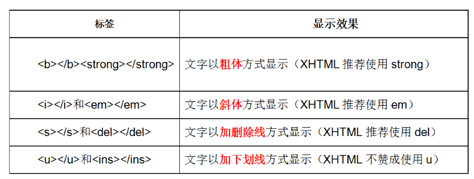

```html
<hr /> 在网页中显示默认样式的水平线
```

例如:

<hr/> 

```html
<br /> 换行
```


```html
<h1>标题</h1>
<h2></h2>
<h3></h3>
....
```

在网页中，有时需要为文字设置粗体、斜体或下划线效果，这时就需要用到HTML中的文本格式化标签，使文字以特殊的方式显示。



b  i  s  u   只有使用 没有 强调的意思       strong   em  del   ins  语义更强烈

